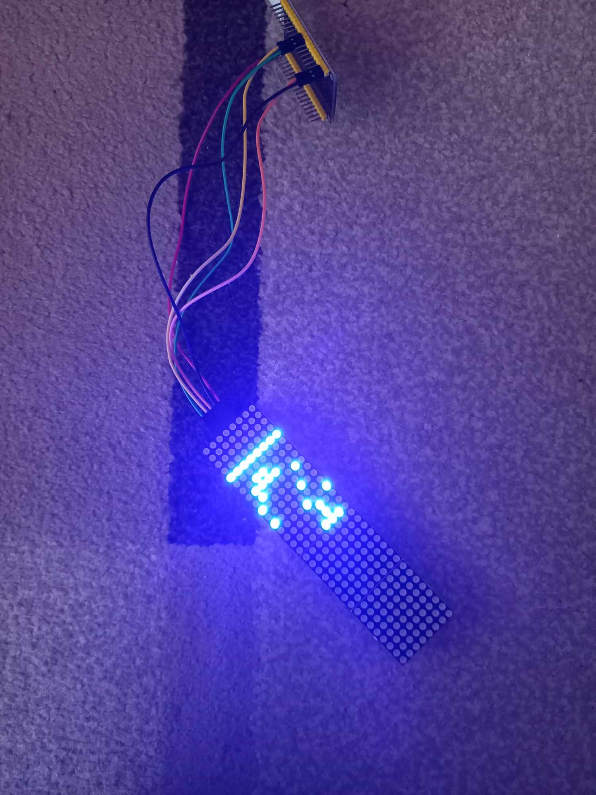

# Conway's Game of Life

**What is Conway's Game of Life?** --> [Wikipedia](https://en.wikipedia.org/wiki/Conway's_Game_of_Life)

## PyGame visualization

- To run simulation (source located in `sim` folder) you need to have [PyGame](https://www.pygame.org/news) library installed.

### How to use it?
- All configuration of application is stored in `config.json` so feel free to change it.
- `life.py` contains all simulation login which allows you to change the rules of evaluating next generation.
- You can also start your simulation with special generation (seed). To do that you need to change offset in `main.py` (random start by default).

## Custom LED display visualization

- To control the MAX7219 LED matrix (four 8 x 8 displays in series), I use ESP32 microcontroller (source located in `embedded` folder).

### How to use it?
- Just power the microcontroller, the visualization will start automatically.
- It is possible to change the initial state of the simulation by modifying `setup` function in `led_display.ino` file.

