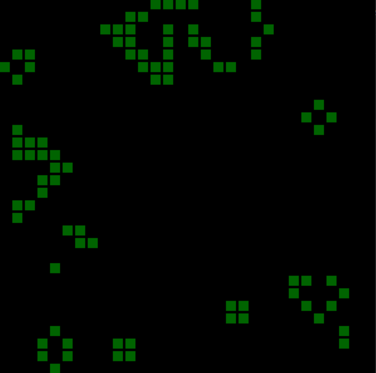

# Conway's Game of Life
Simulation of Conway's Game of Life

This is a visualization of Conway's game of life created in Python with [PyGame](https://www.pygame.org/news) framework.

**What is Conway's Game of Life?** --> [Wikipedia](https://en.wikipedia.org/wiki/Conway's_Game_of_Life)

- To run simulation you need to have [PyGame](https://www.pygame.org/news) library installed

## Usage
- All configuration of application is stored in `config.json` so feel free to change it.
- `life.py` contains all simulation login which allows you to change the rules of evaluating next generation
- You can also start your simulation with special generation. To do that you need to change offset in `main.py` (random start by default)

## Currently in progress
I plan to implement the game on embedded device (ESP32 microcontroller) with small LED matrix as an output device.

Next, I also plan to work with 1D cellular automata and a small LED array to visualize it.

